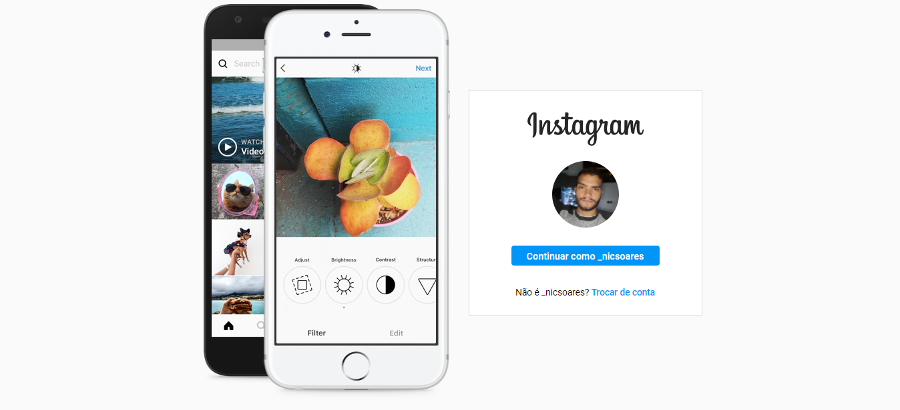

<h1 align="center">Instalogin</h1>

<h3 align="center"> Projeto de fixação de estudos de flexbox da plataforma DIO. </h3>

### screenshot

##  Desenvolvedor 👨🏽‍💻

<table align="center">
    <tr>
        <td align="center">
            
        </td>    
    </tr>
</table>
<h3 align="center">
   Feito com ❤️ por:  <a href="https://www.linkedin.com/in/nicolas-soares-887655220/" target="_blank"> Nicolas Soares </a>
</h3>
